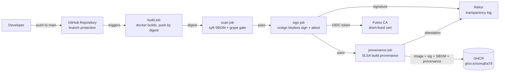
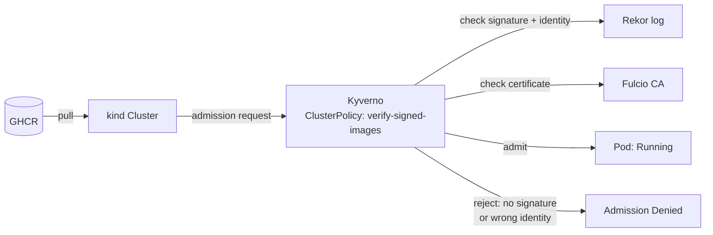

# NovaPay CI/CD Supply Chain Security

Securing the CI/CD software supply chain for a payments-API microservice using **SLSA** (Supply-chain Levels for Software Artifacts) and **Sigstore** (cosign, Fulcio, Rekor).

**Repository:** https://github.com/sonujha78/novapay-supply-chain

This project answers one question from a CTO: *"If an attacker got into our build system or our dependencies tomorrow, how would we know, and how would we stop a poisoned image from reaching production?"*

It does so by building a complete, evidence-backed pipeline — build, scan, sign, attest provenance, and enforce at deploy time — and then attacking it to prove the controls actually hold.

---

## Table of Contents

- [Architecture](#architecture)
- [Repository Structure](#repository-structure)
- [Prerequisites](#prerequisites)
- [Step-by-Step Implementation](#step-by-step-implementation)
  - [Step 0 — Repository and Scaffold](#step-0--repository-and-scaffold)
  - [Step 1 — Sample Application](#step-1--sample-application)
  - [Step 2 — Threat Model (Task 1)](#step-2--threat-model-task-1)
  - [Step 3 — Hardened CI Pipeline (Task 2)](#step-3--hardened-ci-pipeline-task-2)
  - [Step 4 — SBOM and Vulnerability Gate (Task 3)](#step-4--sbom-and-vulnerability-gate-task-3)
  - [Step 5 — Keyless Signing with cosign (Task 4)](#step-5--keyless-signing-with-cosign-task-4)
  - [Step 6 — SLSA Build Provenance (Task 5)](#step-6--slsa-build-provenance-task-5)
  - [Step 7 — Deploy-Time Enforcement with Kyverno (Task 6)](#step-7--deploy-time-enforcement-with-kyverno-task-6)
  - [Step 8 — Attack Simulation (Task 7)](#step-8--attack-simulation-task-7)
  - [Step 9 — Final Report (Task 8)](#step-9--final-report-task-8)
- [A Real Interoperability Bug (and the fix)](#a-real-interoperability-bug-and-the-fix)
- [Verification Command Reference](#verification-command-reference)
- [Documentation Index](#documentation-index)
- [Results Summary](#results-summary)

---

## Architecture

### Pipeline flow



### Deploy-time verification



### Trust boundaries

1. Developer machine → repository (branch protection, PR review)
2. Repository → CI runner (pinned actions, least-privilege tokens)
3. CI runner → external registries (GHCR push, Fulcio/Rekor via OIDC)
4. Registry → cluster (Kyverno admission verification)

---

## Repository Structure

```
novapay-supply-chain/
├── app/                              # Go payments API + Dockerfile
│   ├── main.go
│   ├── go.mod
│   └── Dockerfile
├── .github/
│   ├── workflows/
│   │   └── build-sign-attest.yml     # build → scan → sign → provenance
│   └── dependabot.yml
├── k8s/
│   ├── kind-config.yaml
│   ├── verify-signed-images.yaml     # Kyverno ClusterPolicy
│   ├── pod-signed.yaml
│   └── pod-attack-a2.yaml
├── docs/
│   ├── 01-threat-model.md
│   ├── 03-sbom-and-vuln-gate.md
│   ├── 04-keyless-signing.md
│   ├── 05-slsa-provenance.md
│   ├── 06-deploy-time-enforcement.md
│   ├── 07-attack-simulation.md
│   └── 08-final-report.docx / .pdf
├── evidence/
│   ├── task2-*, task3/, task4-*, task5-*, task6/, task7/
├── .grype.yaml                       # vulnerability risk-acceptance policy
└── README.md
```

---

## Prerequisites

| Tool | Purpose |
|---|---|
| `git`, `gh` (GitHub CLI) | repo and workflow management |
| `docker`, `docker buildx` | image build |
| `cosign` v3.x | keyless signing and verification |
| `syft`, `grype` | SBOM generation and vulnerability scanning |
| `kind`, `kubectl`, `helm` | local Kubernetes cluster and Kyverno install |
| `oras` | inspecting OCI manifests / referrers directly |

```bash
gh auth login
docker --version
cosign version
kind version
kubectl version --client
helm version
```

---

## Step-by-Step Implementation

### Step 0 — Repository and Scaffold

```bash
mkdir -p ~/novapay-supply-chain && cd ~/novapay-supply-chain
git init -b main
gh repo create novapay-supply-chain \
  --public \
  --description "CI/CD supply chain security lab: SLSA, Sigstore/cosign keyless signing, SBOM, provenance and Kyverno admission control" \
  --source=. --remote=origin --push
gh repo edit --add-topic slsa,sigstore,cosign,supply-chain-security,devsecops,kyverno,github-actions
```

---

### Step 1 — Sample Application

A minimal Go HTTP service (`/healthz`, `POST /payments`, `GET /payments/{id}`), built on a **distroless, non-root** base image to keep the attack surface and scan noise low.

```dockerfile
FROM golang:1.24 AS build
WORKDIR /src
COPY go.mod ./
COPY main.go ./
RUN CGO_ENABLED=0 GOOS=linux go build -trimpath -ldflags="-s -w" -o /out/novapay-api .

FROM gcr.io/distroless/static-debian12:nonroot
COPY --from=build /out/novapay-api /novapay-api
EXPOSE 8080
USER nonroot:nonroot
ENTRYPOINT ["/novapay-api"]
```

Local smoke test:

```bash
docker build -t novapay-api:local ./app
docker run -d --rm --name novapay-test -p 8080:8080 novapay-api:local
curl -s localhost:8080/healthz
curl -s -X POST localhost:8080/payments -d '{"amount":499.5,"currency":"INR"}'
docker stop novapay-test
```

```
{"status":"ok"}
{"id":"pay_fc42a5a2a39a2ad2","amount":499.5,"currency":"INR","status":"created","created_at":"2026-09-28T11:45:33Z"}
```

---

### Step 2 — Threat Model (Task 1)

A data-flow diagram plus **18 threats** were mapped against the SLSA supply-chain threat categories (A–I: source, build, dependencies, publishing, consumption), each rated Likelihood/Impact and mapped to a specific control or an accepted, documented risk.

Full table: [`docs/01-threat-model.md`](docs/01-threat-model.md)

Sample rows:

| # | Threat | SLSA | Control |
|---|---|---|---|
| 4 | Compromised third-party Action | D/E | Pin actions to full commit SHA, restrict allowed actions, Dependabot |
| 6 | Stolen signing key | D | Keyless signing, short-lived Fulcio certs, no stored keys |
| 11 | Tag overwrite in registry | G | Deploy by digest, Kyverno verify |
| 15 | Deploy of unverified image | H/I | Kyverno `verifyImages` in Enforce mode |

---

### Step 3 — Hardened CI Pipeline (Task 2)

Key hardening decisions in `.github/workflows/build-sign-attest.yml`:

- `permissions: {}` at the workflow root; every job declares only what it needs.
- Every third-party action pinned to a **full 40-character commit SHA**, with the version kept as a comment.
- Authentication to GHCR uses the built-in, auto-rotated `GITHUB_TOKEN` — no stored registry credentials.
- Untrusted input (branch names, PR titles) is never interpolated directly into `run:` steps.

```bash
# Restrict which actions are allowed to run, require SHA pinning
gh api -X PUT repos/sonujha78/novapay-supply-chain/actions/permissions \
  -F enabled=true -f allowed_actions=selected -F sha_pinning_required=true

gh api -X PUT repos/sonujha78/novapay-supply-chain/actions/permissions/selected-actions \
  -F github_owned_allowed=true -F verified_allowed=false \
  -f 'patterns_allowed[]=docker/*' \
  -f 'patterns_allowed[]=sigstore/*' \
  -f 'patterns_allowed[]=anchore/*' \
  -f 'patterns_allowed[]=slsa-framework/*'

# Default workflow token to read-only
gh api -X PUT repos/sonujha78/novapay-supply-chain/actions/permissions/workflow \
  -f default_workflow_permissions=read -F can_approve_pull_request_reviews=false
```

A repository **ruleset** protects `main` (PR required, no force-push, no deletion, signed commits expected):

```bash
gh api -X POST repos/sonujha78/novapay-supply-chain/rulesets --input ruleset.json
```

```
{
  "id": 24115112,
  "enforcement": "active",
  "current_user_can_bypass": "always"
}
```

---

### Step 4 — SBOM and Vulnerability Gate (Task 3)

The `scan` job generates an SPDX SBOM by digest and runs a `grype` gate that fails the build on any **Critical** finding with a fix available.

```yaml
- name: Generate SBOM (SPDX JSON, by digest)
  uses: anchore/sbom-action@3ad7283483fc7af8ff2b4ea19663c2d5ca935e26 # v0.24.2
  with:
    image: ${{ env.IMAGE }}@${{ env.DIGEST }}
    format: spdx-json
    output-file: sbom.spdx.json

- name: Install grype
  id: grype
  uses: anchore/scan-action/download-grype@27805bf3b4e84b4a5c980df22ed233c00390a439 # v7.4.2

- name: Vulnerability scan (fail on Critical with a fix available)
  run: |
    "$GRYPE" "${IMAGE}@${DIGEST}" --config .grype.yaml -o json --file grype-report.json
    "$GRYPE" "${IMAGE}@${DIGEST}" --config .grype.yaml --only-fixed --fail-on critical -q
```

Result on the distroless base image:

```
SBOM packages: 8
grype matches: 12 (0 Critical/fixable — gate passed)
```

Risk-acceptance entries in `.grype.yaml` require a CVE id, justification, owner, and expiry date, and can only be added via a reviewed pull request.

---

### Step 5 — Keyless Signing with cosign (Task 4)

Every image is signed **by digest**, never by tag, using cosign's keyless OIDC flow. Only the `sign` job in the workflow has `id-token: write`.

```yaml
- name: Sign image (keyless, by digest)
  run: cosign sign --yes --new-bundle-format=false --use-signing-config=false "${IMAGE}@${DIGEST}"

- name: Attest SBOM (SPDX)
  run: cosign attest --yes --new-bundle-format=false --use-signing-config=false --type spdxjson --predicate sbom.spdx.json "${IMAGE}@${DIGEST}"
```

Verified independently from a laptop, with the identity anchored to this exact repository, workflow file, and branch:

```bash
cosign verify "ghcr.io/sonujha78/novapay-supply-chain@sha256:c2aef30af311a4fc3daa87dd1bb52d7b00a475ac176c825094984db0517c087c" \
  --certificate-identity-regexp '^https://github.com/sonujha78/novapay-supply-chain/\.github/workflows/build-sign-attest\.yml@refs/heads/main$' \
  --certificate-oidc-issuer https://token.actions.githubusercontent.com
```

```
Verification for ghcr.io/sonujha78/novapay-supply-chain@sha256:c2aef30af... --
The following checks were performed on each of these signatures:
  - The cosign claims were validated
  - Existence of the claims in the transparency log was verified offline
  - The code-signing certificate was verified using trusted certificate authority certificates
```

Certificate details (Fulcio):

- Subject: `https://github.com/sonujha78/novapay-supply-chain/.github/workflows/build-sign-attest.yml@refs/heads/main`
- Issuer: `https://token.actions.githubusercontent.com`
- Validity: ~10 minutes (short-lived, no key to steal or rotate)

Rekor transparency log entries:

| | Signature | SBOM attestation |
|---|---|---|
| logIndex | 2984075021 | 2984075535 |
| body kind | dsse | dsse |

Full write-up including the three required Q&A: [`docs/04-keyless-signing.md`](docs/04-keyless-signing.md)

---

### Step 6 — SLSA Build Provenance (Task 5)

Chosen approach: **GitHub Artifact Attestations** (`actions/attest-build-provenance`) — GitHub-native, no extra reusable workflow, verifies with `gh attestation verify`.

```yaml
- name: Generate and attest SLSA build provenance
  uses: actions/attest-build-provenance@4d101475d8b20a2381f78447822ac1eab6504dd8 # v4.2.2
  with:
    subject-name: ${{ env.IMAGE }}
    subject-digest: ${{ env.DIGEST }}
    push-to-registry: true
```

```bash
gh attestation verify oci://ghcr.io/sonujha78/novapay-supply-chain@sha256:275b64a4f899e1e2e17bf3826d50e7b95026f3ba3eb1b315a1f3ac054c61de17 \
  --owner sonujha78
```

```
✓ Verification succeeded!

- Attestation #1
  - Build repo:...... sonujha78/novapay-supply-chain
  - Build workflow:.. .github/workflows/build-sign-attest.yml@refs/heads/main
  - Signer repo:..... sonujha78/novapay-supply-chain
  - Signer workflow:. .github/workflows/build-sign-attest.yml@refs/heads/main
```

Decoded provenance (key fields):

| Field | Value |
|---|---|
| Build type | `https://actions.github.io/buildtypes/workflow/v1` |
| Builder ID | `.../build-sign-attest.yml@refs/heads/main` |
| Source commit | `74d7186e16d8e4e4f0392fbe22bfd87c5ac0c465` |
| Run invocation | `.../actions/runs/36465972488/attempts/1` |

**SLSA Build level achieved: L2.** Provenance is generated and signed by a hosted platform, but the build/provenance jobs run on the same class of runner rather than in an isolated, independently-trusted environment — reaching **L3** requires `slsa-framework/slsa-github-generator`'s isolated reusable workflow. Full assessment: [`docs/05-slsa-provenance.md`](docs/05-slsa-provenance.md)

---

### Step 7 — Deploy-Time Enforcement with Kyverno (Task 6)

```bash
kind create cluster --config k8s/kind-config.yaml

helm repo add kyverno https://kyverno.github.io/kyverno/
helm install kyverno kyverno/kyverno --namespace kyverno --create-namespace --wait --timeout 5m

kubectl apply -f k8s/verify-signed-images.yaml
```

Policy excerpt (`k8s/verify-signed-images.yaml`):

```yaml
apiVersion: kyverno.io/v1
kind: ClusterPolicy
metadata:
  name: verify-signed-images
spec:
  validationFailureAction: Enforce
  rules:
    - name: verify-cosign-keyless
      match:
        any:
          - resources:
              kinds: ["Pod"]
      verifyImages:
        - imageReferences:
            - "ghcr.io/sonujha78/novapay-supply-chain*"
          attestors:
            - count: 1
              entries:
                - keyless:
                    issuer: "https://token.actions.githubusercontent.com"
                    subject: "https://github.com/sonujha78/novapay-supply-chain/.github/workflows/build-sign-attest.yml@refs/heads/main"
                    rekor:
                      url: "https://rekor.sigstore.dev"
```

**Signed image — admitted:**

```bash
kubectl apply -f k8s/pod-signed.yaml
kubectl get pod novapay-signed -n novapay-demo
```

```
NAME             READY   STATUS    RESTARTS   AGE
novapay-signed   1/1     Running   0          61s
```

**Unsigned image, same registry path — denied:**

```bash
kubectl run novapay-unsigned --image=ghcr.io/sonujha78/novapay-supply-chain:121d668... -n novapay-demo
```

```
Error from server: admission webhook "mutate.kyverno.svc-fail" denied the request:

resource Pod/novapay-demo/novapay-unsigned was blocked due to the following policies

verify-signed-images:
  verify-cosign-keyless: 'failed to verify image ...: .attestors[0].entries[0].keyless: no signatures found'
```

Full write-up (including a real registry-interoperability bug found and fixed here): [`docs/06-deploy-time-enforcement.md`](docs/06-deploy-time-enforcement.md)

---

### Step 8 — Attack Simulation (Task 7)

Six attacks, each with a detection-vs-prevention classification. Four were executed live against the real pipeline and cluster.

| # | Attack | Result |
|---|---|---|
| A1 | Deploy a laptop-built (unsigned) image | **Rejected** — `no signatures found` |
| A2 | Sign from a wrong ref (fork-equivalent identity) and deploy | **Rejected** — `subject mismatch: expected .../refs/heads/main, received .../refs/heads/attack-a2-untrusted-ref` |
| A3 | Overwrite a tag and deploy by tag | **N/A by design** — every manifest deploys by digest, not tag |
| A4 | Edit the workflow to exfiltrate secrets via a direct push | **Flagged** by the ruleset (PR + signed-commit rules); bypassed only via the documented admin exception |
| A5 | Compromised build step tampers with the artifact post-build | **Detected only** — SLSA L2 does not prove build-step integrity; L3 required to fully close this |
| A6 | Malicious/vulnerable dependency swapped in | **Detected via SBOM** post-disclosure; a zero-day with no CVE is not blocked pre-merge |

Full attack log with command evidence: [`docs/07-attack-simulation.md`](docs/07-attack-simulation.md)

---

### Step 9 — Final Report (Task 8)

A 7-page executive report covering the executive summary, pipeline architecture, gap analysis (with a prioritized 3-action remediation plan), an incident response playbook, and operational concerns (key rotation, verification latency, Sigstore outage handling, private Sigstore).

[`docs/08-final-report.docx`](docs/08-final-report.docx) / [`docs/08-final-report.pdf`](docs/08-final-report.pdf)

---

## A Real Interoperability Bug (and the fix)

cosign v3 defaults to storing signatures and attestations using the **OCI 1.1 Referrers API**. GHCR does not yet fully support that API for verification clients. The result: images were genuinely, correctly signed — `cosign sign` succeeded, Rekor recorded a valid entry — but **every** verifier tested (Kyverno, cosign v2, cosign v3 itself from a different context) reported `no signatures found`, because they were all looking in a location GHCR could not serve.

Diagnosed by direct evidence, not assumption:

```bash
oras discover --format json "ghcr.io/sonujha78/novapay-supply-chain@sha256:<digest>"
# → signature and attestation ARE present, as OCI referrers

oras manifest fetch "ghcr.io/sonujha78/novapay-supply-chain:sha256-<digest>.sig"
# → Error: not found  (the legacy tag verifiers actually look for)
```

**Fix** — force cosign to also publish the legacy tag-based layout:

```bash
cosign sign --yes --new-bundle-format=false --use-signing-config=false "${IMAGE}@${DIGEST}"
cosign attest --yes --new-bundle-format=false --use-signing-config=false --type spdxjson --predicate sbom.spdx.json "${IMAGE}@${DIGEST}"
```

Re-verified end-to-end afterward: legacy `.sig`/`.att` tags present, `cosign verify` passing from both a laptop and from inside the `kind` cluster, and Kyverno admitting the signed pod.

**Lesson:** a signing step and a verification step can each report success independently while the system as a whole is silently broken, if they disagree on a registry-capability default. Always test the full sign-then-verify loop against the real target verifier before trusting a new tool version in production.

---

## Verification Command Reference

```bash
# Verify a signature and its identity
cosign verify "$IMG" \
  --certificate-identity-regexp "$ID_RE" \
  --certificate-oidc-issuer "$ISS"

# Verify the SBOM attestation
cosign verify-attestation --type spdxjson "$IMG" \
  --certificate-identity-regexp "$ID_RE" \
  --certificate-oidc-issuer "$ISS"

# Verify SLSA provenance
gh attestation verify "oci://$IMG" --owner sonujha78

# Verify from inside the cluster (matches what Kyverno does)
kubectl run cosign-debug --rm -it --image=gcr.io/projectsigstore/cosign:v2.4.1 --restart=Never -n novapay-demo -- \
  verify "$IMG" --certificate-identity-regexp "$ID_RE" --certificate-oidc-issuer "$ISS"
```

---

## Documentation Index

| Task | Document |
|---|---|
| 1 — Threat model | [`docs/01-threat-model.md`](docs/01-threat-model.md) |
| 2 — Pipeline hardening | [`.github/workflows/build-sign-attest.yml`](.github/workflows/build-sign-attest.yml) |
| 3 — SBOM & vulnerability gate | [`docs/03-sbom-and-vuln-gate.md`](docs/03-sbom-and-vuln-gate.md) |
| 4 — Keyless signing | [`docs/04-keyless-signing.md`](docs/04-keyless-signing.md) |
| 5 — SLSA provenance | [`docs/05-slsa-provenance.md`](docs/05-slsa-provenance.md) |
| 6 — Deploy-time enforcement | [`docs/06-deploy-time-enforcement.md`](docs/06-deploy-time-enforcement.md) |
| 7 — Attack simulation | [`docs/07-attack-simulation.md`](docs/07-attack-simulation.md) |
| 8 — Final report | [`docs/08-final-report.docx`](docs/08-final-report.docx) |

---

## Results Summary

- ✅ 18-threat model mapped to SLSA categories A–I
- ✅ Hardened CI: default-deny permissions, full-SHA-pinned actions, no long-lived secrets, branch ruleset
- ✅ SBOM (SPDX) + grype gate on every build
- ✅ Keyless cosign signing + SBOM attestation, verified against an anchored identity
- ✅ SLSA Build Level 2 provenance, independently verified
- ✅ Kyverno admission control: signed image admitted, unsigned image denied
- ✅ 6 simulated attacks with honest detection-vs-prevention classification
- ✅ Full executive report with gap analysis and incident response playbook

**Known gaps (documented, not hidden):** SLSA Build L3 not yet reached (build-step isolation); repository admin has a branch-protection bypass; a zero-day dependency with no published CVE is not blocked pre-merge. See Section 3 of the final report for the prioritized remediation plan.
