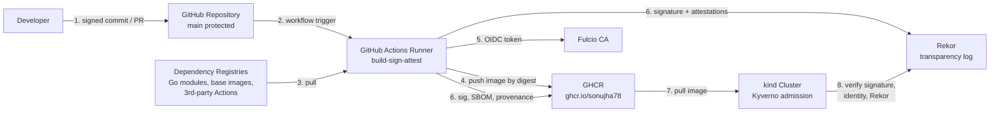

# Task 1: Threat Model

## 1. Data-Flow Diagram

Trust boundaries: (a) developer machine to repo, (b) repo to CI runner, (c) CI runner to external registries, (d) registry to cluster.

## 2. SLSA Threat Mapping

SLSA categories: A = Source (submit unauthorized change), B = Source (compromise source repo), C = Build (modify source after checkout), D = Build (compromise build platform), E = Dependencies, F = Bypass CI, G = Compromise package registry, H = Use compromised package, I = Consumption.

## 3. Threat Table

| # | Threat | SLSA | Example in this pipeline | L | I | Planned control |
|---|--------|------|---------------------------|---|---|------------------|
| 1 | Unauthorized code merged | A | Attacker or rogue contributor merges malicious code to main | M | H | Branch protection, required reviews, verified commits |
| 2 | Compromised repo account | B | Maintainer credentials stolen, force-push to main | M | H | 2FA, no force-push, signed commits, audit log |
| 3 | Malicious workflow change via PR | D | PR edits workflow to print secrets or add `id-token: write` | M | H | `permissions: {}`, CODEOWNERS on `.github/`, required reviews, no `pull_request_target` |
| 4 | Compromised third-party Action | D/E | Popular action modified to dump secrets (tj-actions style) | M | H | Pin actions to full commit SHA, restrict allowed actions, Dependabot |
| 5 | Script injection in workflow | D | PR title or branch name interpolated into `run:` | M | H | Pass untrusted input via `env:`, never inline `${{ }}` in scripts |
| 6 | Stolen signing key | D | Long-lived key leaks from CI secret | L | H | Keyless signing, short-lived Fulcio certs, no stored keys |
| 7 | Build step tampers artifact | C/D | Compromised step modifies binary after build | L | H | Separate provenance job (SLSA generator), digest verification |
| 8 | Malicious or typosquatted dependency | E | Bad Go module added in PR | M | H | go.sum lockfile, SBOM, dependency review, vuln gate |
| 9 | Vulnerable dependency | E | Known CVE in base image or module | H | M | grype gate (fail on Critical with fix), distroless base |
| 10 | Poisoned base image | E | Upstream base image tag repointed | L | H | Pin base image by digest, scan final image |
| 11 | Tag overwrite in registry | G | Attacker re-pushes `:latest` with malicious image | M | H | Sign and deploy by digest, Kyverno verify |
| 12 | Registry compromise / unsigned push | G | Image pushed to GHCR bypassing CI | M | H | Kyverno requires signature from workflow identity |
| 13 | Bypass CI (build on laptop) | F | Developer pushes locally built image | M | H | Admission policy rejects images without CI identity |
| 14 | Signature from wrong repo/fork | I | Attacker signs with their own repo's workflow | M | H | Strict `certificate-identity` anchored to repo, workflow, ref |
| 15 | Deploy of unverified image | H/I | Cluster runs image with no verification | H | H | Kyverno `verifyImages` in Enforce mode |
| 16 | Sigstore outage / log tampering | I | Rekor or Fulcio unreachable or manipulated | L | M | Rekor verification, documented fail-closed policy and fallback |
| 17 | Secrets committed to repo | B | Token or key pushed in a commit | M | H | `.gitignore`, secret scanning, push protection |
| 18 | Missing evidence of what was built | C/D | No way to trace image to commit and workflow | M | M | SLSA provenance + SBOM attestation |

## 4. Accepted Risks

- **Threat 16 (Sigstore outage):** accepted with fail-closed policy; documented in Task 8 operational concerns.
- **Single maintainer:** two-person review is not possible in a solo lab; noted as a gap in Task 8.
